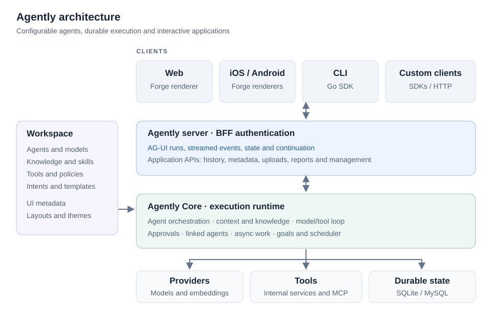

# Agently

Agently is an agentic application framework with a ready-to-run server, CLI,
web application, and native iOS and Android shells. It brings together
configurable agents, models, tools, knowledge, durable conversations, and
interactive workspaces.

Build assistants that work with your APIs and data, ask for missing information
or approvals, delegate tasks, produce reports, and continue scheduled work.
Application behavior and appearance are defined by the workspace; the framework
is not tied to one business domain.

## Why Agently

Agently provides the execution engine and the application around it. A workspace
connects agent instructions, model choices, knowledge, tools and UI metadata,
so the same assistant can reason over data, ask for approval and present an
interactive result within one conversation.

- **Declarative applications.** Define agents, intent profiles, tool bundles,
  skills, templates, data sources and application windows as workspace resources.
  Reuse configuration across assistants and customize navigation, layout and
  appearance for your application.
- **Work that survives the session.** Persist conversations, tool calls and run
  state; coordinate queued turns, asynchronous operations, linked agents, goals
  and schedules. Reopen work and recover from interruption using saved state.
- **Governed access to tools and data.** Combine internal services and MCP tools
  under common dispatch, authorization and approval policies. Use forms and
  lookups to collect precise inputs before execution.
- **Results people can use.** Go beyond text with live tool feeds, tables,
  charts, reports and hosted workspaces. Keep these results associated with their
  conversation and expose them through web, native mobile or custom clients.
- **An extensible runtime.** Embed Core in your Go service or use the assembled
  server. Choose providers and integrations, add tools and metadata, and build
  clients against the [AG-UI protocol](https://docs.ag-ui.com/spec/1.0) and application APIs.

## Architecture

Agently assembles [Agently Core](https://github.com/viant/agently-core), which
owns execution and persistence, with [Forge](https://github.com/viant/forge),
which renders metadata-driven interfaces.



A prompt enters an authenticated conversation. The runtime resolves the agent,
model, instructions and available tools, assembles knowledge and history, then
runs the model/tool loop. Tool policy can block execution or request approval;
elicitation can collect missing inputs. Messages, calls and execution state are
persisted as work progresses. Clients render the canonical results and can
reattach after a disconnect without submitting the prompt again.

[AG-UI](https://docs.ag-ui.com/spec/1.0) connects clients to the conversation runtime: runs, streamed messages,
tool activity, state and interactive continuation. Agently extensions carry
workspace presentation, tool feeds, goals, approvals and queue controls. The
BFF applies authentication across this interaction and the application APIs for
history, metadata, uploads, reporting and management. All clients share the same
execution and persistence services; Forge renders the workspace's authored UI.

## Capabilities

| Area | What you can build or configure |
| --- | --- |
| Agents and orchestration | Agent/model selection, intake profiles, prompt binding, iterative model/tool execution, parallel tools, linked agents and follow-up chains |
| Models and knowledge | Multiple model providers, embedding-based knowledge retrieval, budgeted prompt augmentation, instructions, skills and reusable templates |
| Tools and integration | Internal tools and MCP servers, bundles and policies, resources, optional MCP exposure and A2A endpoints |
| Conversations | Durable history, streaming, attachments, queued turns, cancellation, recovery and continuation |
| Human interaction | Server-driven forms, lookups, input refinement, immediate or queued tool approval and editable approval inputs |
| Autonomous work | Conversation goals, usage budgets, controller-owned continuation, schedules and long-running asynchronous operations |
| Application UI | Workspace-defined navigation, windows, layouts, actions, themes, CSS, fonts, inline or detached tool feeds and MCP Apps |
| Reporting | Authored report definitions, scoped datasets, charts and tables, durable report lifecycle, saved results and explicit export/publication |
| Security and operations | Local/JWT/OAuth authentication, BFF sessions, scoped MCP credentials, SQLite/MySQL persistence, cleanup and separate scheduler runners |
| Clients and extension | Go, TypeScript, Swift and Kotlin SDKs; web/mobile shells; custom tools, providers, runtime integrations and presentation |

Provider capabilities vary. The configured core adapters include OpenAI,
Vertex AI Gemini/Claude, Bedrock Converse/Claude, Grok, InceptionLabs and Ollama.
Uploads and resource tools support file inspection and extraction; multimodal
model input and optional speech transcription depend on the chosen adapter.

Context management derives the model-visible history from durable conversation
state. Limits, pruning and overflow recovery are configurable; proactive
percentage-based compaction is an optional agent setting. See the
[context guide](https://github.com/viant/agently-core/blob/ag-ui/doc/context-management.md)
and [compaction settings](https://github.com/viant/agently-core/blob/ag-ui/doc/proactive-context-compaction.md).

## Build and run

Requires Go 1.25.8 or newer. Configure a workspace model and its provider
credentials before making a model request. The Go module selects the server's
runtime dependencies.

```bash
go build -o ./bin/agently ./agently
./bin/agently serve -a :8080 -w /path/to/workspace
./bin/agently query --api http://localhost:8080 -q "Summarize the project documentation"
./bin/agently list-tools --api http://localhost:8080
```

## Workspace configuration and customization

The application workspace defaults to `.agently` in the working directory; `AGENTLY_WORKSPACE` or
`serve --workspace` selects another root. It is the authored configuration of
an application, separate from the conversation-owned UI workspace that holds
open reports and windows.

```text
workspace/
  config.yaml                 # Application defaults and service configuration
  agents/                     # Prompts, model selection, knowledge and tools
  models/                     # Model/provider definitions
  embedders/                  # Embedding providers
  mcp/                        # MCP client connections
  tools/bundles/              # Tool groups and approval policy
  tools/instructions/         # Tool-specific instructions
  intents/                    # Scenario profiles and routing context
  skills/                     # Reusable skill resources
  templates/                  # Output templates and template bundles
  workflows/                  # Workflow resources
  feeds/                      # Tool-output feed definitions
  oauth/                      # Identity-provider resources
  a2a/                        # Agent-to-agent definitions
  callbacks/                  # Interaction callbacks
  extension/forge/
    datasources/              # Data bindings for forms and views
    dialogs/                  # Dialog definitions
    lookups/                  # Lookup/picker configuration
    models/                   # UI model metadata
    windows/                  # Hosted window definitions
```

Select resource IDs in `config.yaml`, for example:

```yaml
default:
  agent: assistant
  model: configured-model
  appName: Project Assistant
ui:
  composer:
    allowAgentSelection: true
    allowModelSelection: true
```

Define `agents/assistant.yaml` and the matching model resource. An agent's
instructions can use prompt bindings; its configuration can select knowledge,
tool bundles, skills, templates and execution limits. Provider credentials and
model options belong to the model/provider configuration, not the prompt.
For example, the agent can start with an explicitly bound task prompt:

```yaml
id: assistant
name: Project Assistant
temperature: 0
parallelToolCalls: true
prompt:
  engine: go
  text: "{{.Task.Prompt}}"
```

Tool bundles determine which operations the agent can use and their approval
rules. A bundle can require queued approval for a tool group:

```yaml
match:
  - name: "project:*"
    approval:
      mode: queue
```

These are configuration fragments, not a complete provider setup. The
[workspace](https://github.com/viant/agently-core/blob/ag-ui/doc/workspace-system.md)
and [agent authoring](https://github.com/viant/agently-core/blob/ag-ui/doc/prompts.md)
guides describe these contracts.

Workspace YAML can import reusable fragments and parameterize them in a scoped
context. Exact parameter substitutions preserve YAML types. Resources can be
managed as versioned files or through workspace resource APIs. Loading and
reload behavior are handled by the resource repositories and their consumers.

UI customization is also declarative: navigation, starter prompts, windows,
controls, data sources and actions are driven by metadata. Web, iOS and Android
can resolve platform/form-factor-specific definitions. Named themes, fonts and
scoped workspace CSS control appearance; web CSS remains web styling, while
native renderers consume their supported theme and metadata contracts.
Inline tool feeds and conversation-owned windows have distinct ownership and
placement. See [workspace UI](doc/workspace-ui.md) and
[UI ownership](https://github.com/viant/agently-core/blob/ag-ui/doc/ui-ownership-model.md).

For integration beyond configuration, register internal tool services or connect
MCP servers, add resource finders and application handlers through Core, and
compose Forge with application-owned data/action connectors. Forge is a separate
data-driven UI framework; Agently owns the agent runtime, authentication and
conversation coordination around it.

Use `serve --help` and `query --help` for deployment and authentication options.
The server supports local sessions, JWT and OAuth modes. Configure the identity
provider and tool policy for your deployment. The coarse `--policy` setting
supports `auto`, `ask` and `deny`; tool-bundle rules refine approval behavior.

SQLite is the workspace default; MySQL uses a configured connection and
versioned schema. Scheduler API and runner roles can be deployed separately.
Key settings include `AGENTLY_DB_DRIVER`, `AGENTLY_DB_DSN`,
`AGENTLY_SCHEDULER_API`, `AGENTLY_SCHEDULER_RUNNER` and the cleanup policies.
Conversation, execution and report state share the application's persistence
lifecycle, including authorization, retention and cleanup.

## Documentation

The guides below are tracked in Git. Framework guides live in Agently Core;
application and platform guides live here. Start with architecture, workspace
configuration and the tool system, then follow the guide for your use case.

| Topic | Guides |
| --- | --- |
| Architecture and execution | [Core architecture](https://github.com/viant/agently-core/blob/ag-ui/doc/architecture.md), [agent orchestration](https://github.com/viant/agently-core/blob/ag-ui/doc/agent-orchestration.md), [planning/intake](https://github.com/viant/agently-core/blob/ag-ui/doc/planning-and-intake.md) |
| Agent authoring | [Workspace configuration](https://github.com/viant/agently-core/blob/ag-ui/doc/workspace-system.md), [intent profiles](https://github.com/viant/agently-core/blob/ag-ui/doc/prompts.md), [prompt binding](https://github.com/viant/agently-core/blob/ag-ui/doc/prompt-binding.md), [skills](https://github.com/viant/agently-core/blob/ag-ui/doc/skills.md), [templates](https://github.com/viant/agently-core/blob/ag-ui/doc/templates.md) |
| Models, knowledge and files | [Providers](https://github.com/viant/agently-core/blob/ag-ui/doc/llm-providers.md), [knowledge augmentation](https://github.com/viant/agently-core/blob/ag-ui/doc/augmentation.md), [embeddings](https://github.com/viant/agently-core/blob/ag-ui/doc/embedius-embeddings.md), [resources](https://github.com/viant/agently-core/blob/ag-ui/doc/resources.md), [speech](https://github.com/viant/agently-core/blob/ag-ui/doc/speech.md) |
| Tools and interoperability | [Tool system](https://github.com/viant/agently-core/blob/ag-ui/doc/tool-system.md), [internal tools](https://github.com/viant/agently-core/blob/ag-ui/doc/internal-tools.md), [MCP integration](https://github.com/viant/agently-core/blob/ag-ui/doc/mcp-integration.md), [A2A](https://github.com/viant/agently-core/blob/ag-ui/doc/a2a-protocol.md) |
| Human input and approvals | [Elicitation](https://github.com/viant/agently-core/blob/ag-ui/doc/elicitation-system.md), [lookups](https://github.com/viant/agently-core/blob/ag-ui/doc/lookups.md), [schema overlays](https://github.com/viant/agently-core/blob/ag-ui/doc/overlays.md), [approval policy](https://github.com/viant/agently-core/blob/ag-ui/doc/approval.md) |
| Goals, schedules and background work | [Goals](https://github.com/viant/agently-core/blob/ag-ui/doc/autonomous.md), [scheduler](https://github.com/viant/agently-core/blob/ag-ui/doc/scheduler.md), [async operations](https://github.com/viant/agently-core/blob/ag-ui/doc/async.md), [follow-up chains](https://github.com/viant/agently-core/blob/ag-ui/doc/followup-chains.md) |
| UI and reporting | [Workspace UI and appearance](doc/workspace-ui.md), [architecture](https://github.com/viant/agently-core/blob/ag-ui/doc/architecture.md), [UI ownership](https://github.com/viant/agently-core/blob/ag-ui/doc/ui-ownership-model.md), [feeds](https://github.com/viant/agently-core/blob/ag-ui/doc/feed-system.md), [MCP UI](https://github.com/viant/agently-core/blob/ag-ui/doc/mcp-ui.md) |
| Client integration | [SDK guide](https://github.com/viant/agently-core/blob/ag-ui/doc/sdk.md), [AG-UI operation matrix](https://github.com/viant/agently-core/blob/ag-ui/doc/ag-ui-operation-matrix.md), [iOS](doc/ios.md), [Android](doc/android.md) |
| Security and persistence | [Authentication](https://github.com/viant/agently-core/blob/ag-ui/doc/auth-system.md), [authorization policy](https://github.com/viant/agently-core/blob/ag-ui/doc/authorization-policy.md), [conversation model](https://github.com/viant/agently-core/blob/ag-ui/doc/conversation-model.md), [storage contracts](https://github.com/viant/agently-core/blob/ag-ui/doc/conversation-model.md), [cleanup](doc/database-cleanup.md) |

The [Core documentation index](https://github.com/viant/agently-core/blob/ag-ui/doc/README.md)
links to additional design, configuration and lifecycle references.

## Development and extension

| Path | Responsibility |
| --- | --- |
| `agently/`, `cmd/agently/` | Binary entry point and CLI |
| `serve.go`, `runtime/`, `bootstrap/` | Server assembly, integrations and defaults |
| `metadata/`, `ui/`, `deployment/ui/` | Authored metadata, web source and embedded assets |
| `ios/`, `android/` | Native shells and platform dependency selection |
| `doc/`, `e2e/`, `preview/` | Guides, test workflows and previews |

Custom applications can register tools, connect MCP servers, configure agent
resources, extend metadata, or compose their own shell over Core's SDKs.
For an embedded runtime, start with the [Core architecture guide](https://github.com/viant/agently-core/blob/ag-ui/doc/architecture.md).

```bash
# Build and safely sync web assets, preserving deployment/ui/init.go
(cd ui && npm ci && npm test && npm run build:embed)
go build -o ./bin/agently ./agently

# Native source checks
swift test --package-path ios
(cd android && ./gradlew -Pagently.android.useSiblingSources=true :app:testDebugUnitTest :app:assembleDebug)
```

Web npm sources, Swift package links and Android dependency selection are
independent of Go module replacements. Inspect their manifests when developing
against sibling sources. Android requires JDK 17 and the Android SDK; iOS device
builds require Xcode. Installation, signing and real service-connected tests are
covered in the platform guides.
